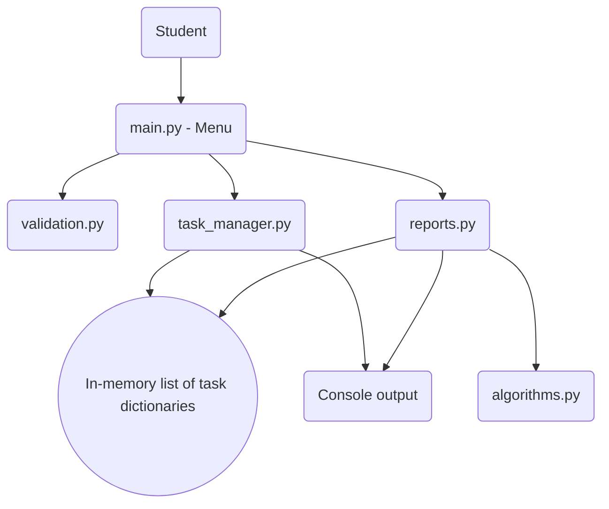
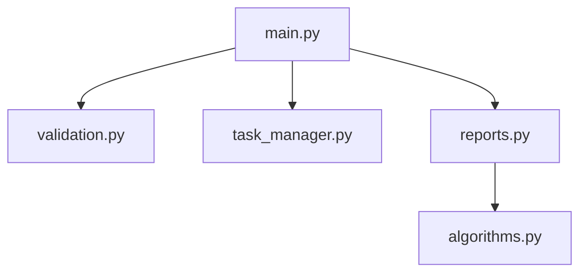

# Design and Documentation

## Functional Requirements
1. The system shall display menu until the user chooses to exit.
2. The system shall get non-empty task title and assign its sequential ID.
3. The system shall show all tasks or filter them based on their completion.
4. The system shall mark the found task as completed.
5. The system shall delete the found task.
6. The system shall compute and show total, completed and pending tasks.
7. The system shall not accept invalid menu choice, empty title, or invalid (not positive numeric) task ID.

## Non-Functional Requirements
- **Usability:** easy-to-understand menu choices and prompts.
- **Reliability:** checking validity of inputs and handling of an empty task list and an unknown task ID.
- **Maintainability:** separation of responsibilities between small Python modules.
- **Resource efficiency:** using a simple list-based structure and sequential search that is efficient enough for a small personal task list.- **Readability:** meaningful function names, comments, and consistent output.
## Inputs and Outputs
| Input      | Process   | Output         |
|------------|-----------|----------------|
| Choice from menu | Condition evaluation  | Operation performed    |
| Name of task     | Validation for empty input | Task saved with ID   |
| ID of task       | Numeric check and existence check | Task completed or deleted    |
| List of tasks    | Counting and summarizing  | Summary of tasks     |

## Top-Down Design
Main problem is split into:
- **User interface (`main.py`):** menu and sequence of actions.
- **Tasks (`task_manager.py`):** add, show, complete and remove.
- **Validation of inputs (`validation.py`):** text, choices and ID validation.
- **Summarization (`reports.py`):** creation of task statuses count.
- **Algorithms (`algorithms.py`):** basic counting and summing functions.## System Architecture Diagram


## Process Workflow
```mermaid
flowchart TD
    A([Start]) --> B(Create empty task list)
    B --> C(Display menu)
    C --> D(Choice)
    D -->|Add| E(Validate title and add task)
    D -->|View| F(Display selected task view)
    D -->|Complete| G(Validate ID and update status)
    D -->|Delete| H(Validate ID and remove task)
    D -->|Summary| I(Count total and status)
    E --> C
    F --> C
    G --> C
    H --> C
    I --> C
    D -->|Exit| J([End])
```## Use Case Diagram
```mermaid
flowchart LR
    U[Student] --> A((Add task))
    U --> B((View tasks))
    U --> C((Complete task))
    U --> D((Delete task))
    U --> E((View summary))
    U --> F((Exit))
```

## Component Diagram


## Sequence Diagram
```mermaid
sequenceDiagram
    participant Student
    participant Main as main.py
    participant Validation as validation.py
    participant Tasks as task_manager.py
    Student->>Main: Add Task selected
    Main->>Validation: Read title (non-empty)
    Validation-->>Main: Title is valid
    Main->>Tasks: Add to task list
    Tasks-->>Main: Next id generated
    Main-->>Student: Success message shown
```## Data Structures / Storage Design
There is no use of any database or any external storage. Each task will be a dictionary with following attributes:
- `id`: positive integer to identify the task during current session
- `title`: string to store description of the task
- `completed`: Boolean status

These task dictionaries will be stored in list. This is a good choice considering the size of the project and level. The information will be erased upon exit.

## Algorithms Used
- **Counting:** iterate through list of tasks and increase counter.
- **Summation:** summation of status to find total number of completed and pending tasks.
- **Linear Search:** iteration through list of tasks to locate a task having ID as match.
- **Insertion and Deletion:** appending dictionary in the list and deleting list element respectively.

## Design Choices and Rationale
Command line interface will keep our project focused on basics of Python language. Lists and dictionaries facilitate our task list and attributes. Function decomposition separates functionalities of the program. In memory storage will prevent us from using file-handling/database concepts that are not present in given syllabus.## Implementation Details
Five modules in Python are used in this project, which are `main.py`, `task_manager.py`, `reports.py`, `algorithms.py`, and `validation.py`. The folder `tests` contains a simple validation script.

## Testing Procedure
- Test counting and summing for empty and non-empty lists.
- Test creation of the task, its ID, title, and status.
- Test updates of the status and deleting the task.
- Test manually the incorrect user choices, empty titles, empty list of tasks, and incorrect ID.

## Challenges Encountered
Some of the possible problems that can appear will be task IDs consistency after deletion, filtering tasks by their status, and protection against the invalid input affecting the menu flow. Task IDs are not recycled during one session, while the validation functions process the expected exceptions.

## Learnings and Main Insights
This project provides an example of the top-down design, modularity, functions, control structures, lists, dictionaries, linear search, counting, summing, and input validation.

## Further Improvements
In case they are allowed in another course, this project could be extended with the possibility of storing information persistently, adding due dates, reminders, or creating a graphical interface.
